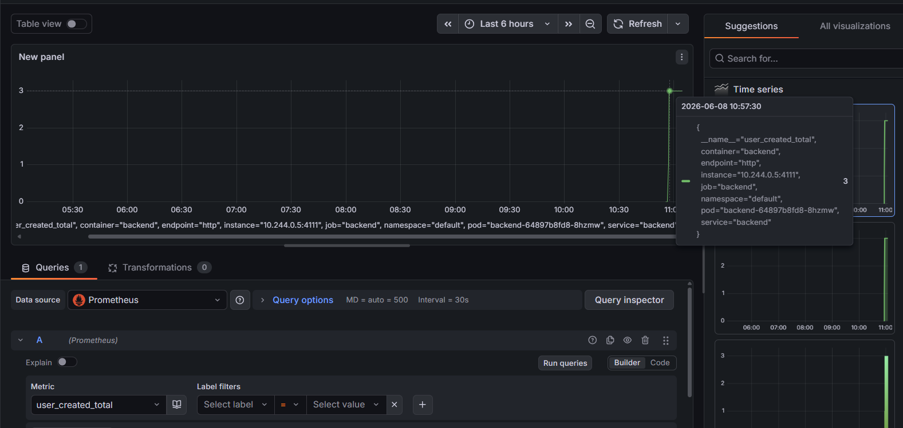
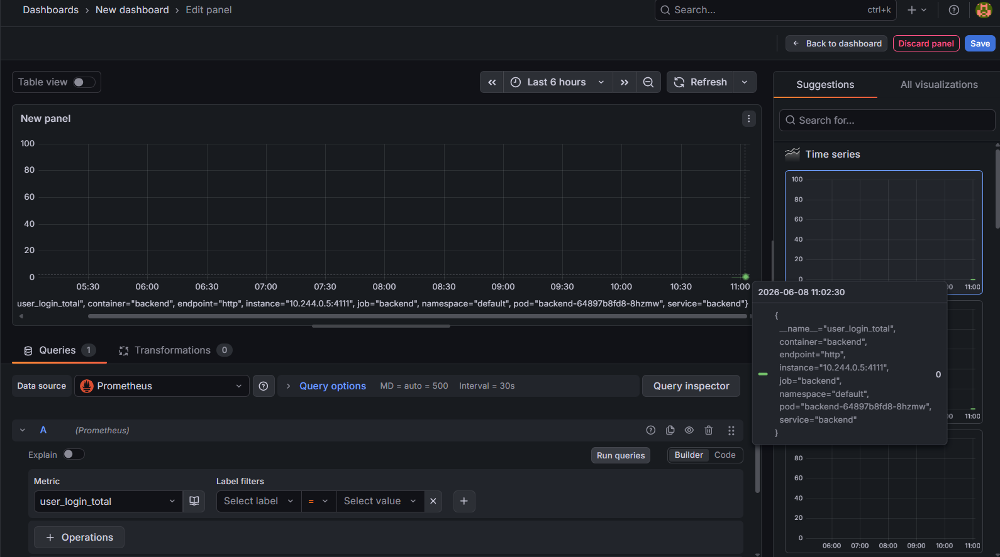
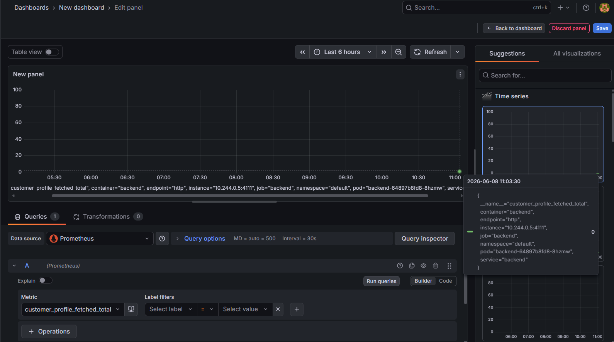
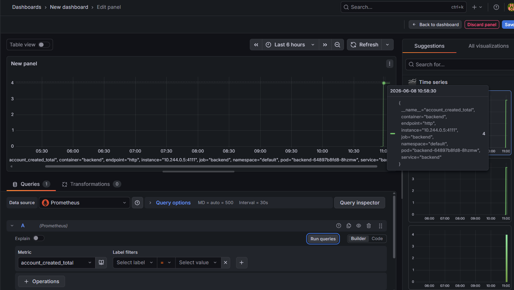
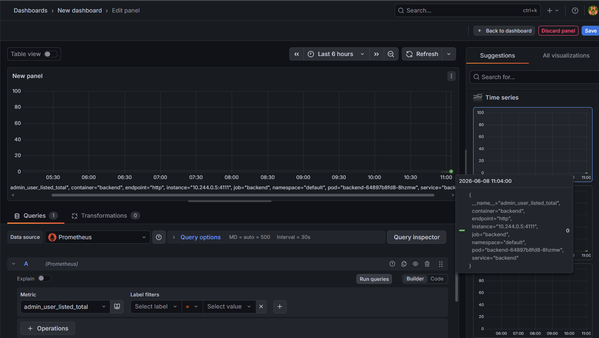
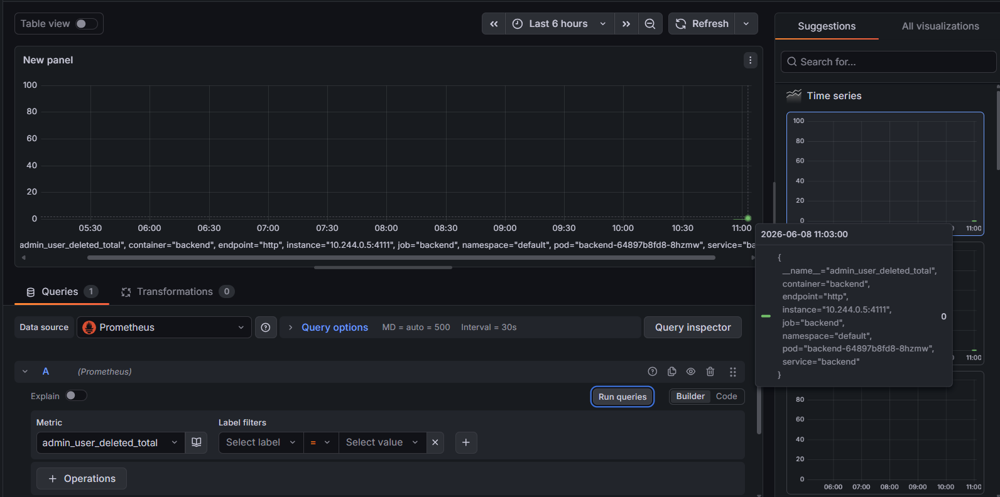
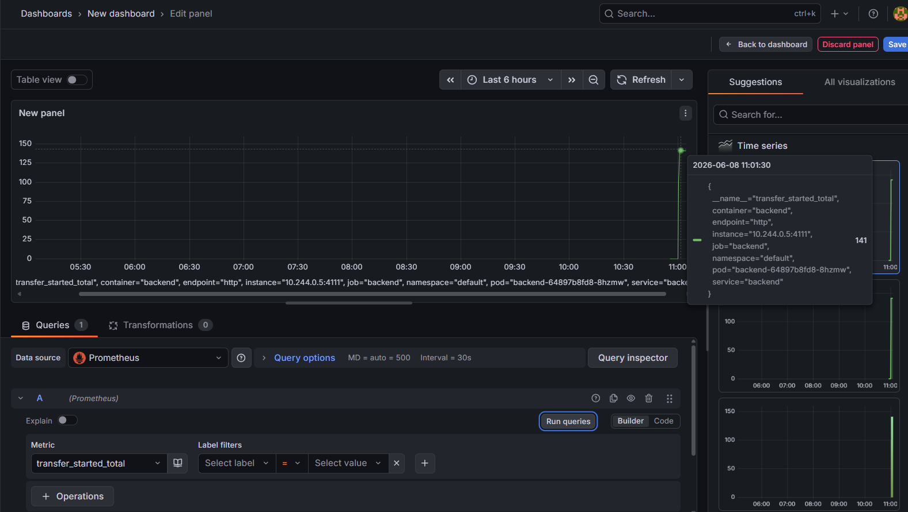
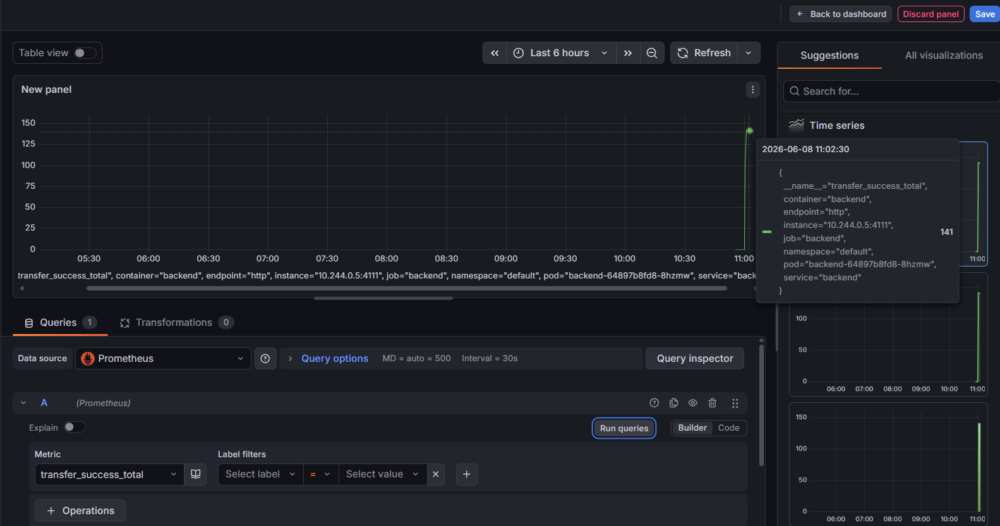

# Сколько новых пользователей было создано за последние сутки?
3

{"timestamp":"2026-06-08T03:56:49.263700223Z","logger_name":"me.nobugs.bank.controllers.AdminController","thread_name":"http-nio-4111-exec-5","level":"INFO","message":"Admin request: create user 'kate1998'"}
{"timestamp":"2026-06-08T03:56:49.362204805Z","logger_name":"me.nobugs.bank.controllers.AdminController","thread_name":"http-nio-4111-exec-5","level":"INFO","message":"User 'kate1998' created successfully with role 'USER'"}
{"timestamp":"2026-06-08T03:56:52.664391463Z","logger_name":"me.nobugs.bank.controllers.AdminController","thread_name":"http-nio-4111-exec-6","level":"INFO","message":"Admin request: create user 'kate1998'"}
{"timestamp":"2026-06-08T03:56:52.66460847Z","logger_name":"me.nobugs.bank.controllers.AdminController","thread_name":"http-nio-4111-exec-6","level":"WARN","message":"User creation failed: 'kate1998' already exists"}
{"timestamp":"2026-06-08T03:57:06.204450701Z","logger_name":"me.nobugs.bank.controllers.AdminController","thread_name":"http-nio-4111-exec-8","level":"INFO","message":"Admin request: create user 'user8PGRcRzS'"}
{"timestamp":"2026-06-08T03:57:06.270332875Z","logger_name":"me.nobugs.bank.controllers.AdminController","thread_name":"http-nio-4111-exec-8","level":"INFO","message":"User 'user8PGRcRzS' created successfully with role 'USER'"}
{"timestamp":"2026-06-08T03:57:06.564702839Z","logger_name":"me.nobugs.bank.controllers.AdminController","thread_name":"http-nio-4111-exec-10","level":"INFO","message":"Admin request: create user 'userbSlx3Iwa'"}

# Сколько раз пользователи входили в систему ()?
0

# Сколько раз запрашивали профиль клиента, и сколько раз он был обновлён?
0 и 0

# Сколько аккаунтов было создано?
4

{"timestamp":"2026-06-08T03:58:06.908872745Z","logger_name":"me.nobugs.bank.controllers.AccountController","thread_name":"http-nio-4111-exec-8","level":"INFO","message":"Account created for user 'user8PGRcRzS': 1"}
{"timestamp":"2026-06-08T03:58:07.232850485Z","logger_name":"me.nobugs.bank.controllers.AccountController","thread_name":"http-nio-4111-exec-10","level":"INFO","message":"Request to create account for user 'user8PGRcRzS'"}
{"timestamp":"2026-06-08T03:58:07.233026891Z","logger_name":"me.nobugs.bank.controllers.AccountController","thread_name":"http-nio-4111-exec-10","level":"INFO","message":"Account created for user 'user8PGRcRzS': 2"}
{"timestamp":"2026-06-08T03:58:07.532265088Z","logger_name":"me.nobugs.bank.controllers.AccountController","thread_name":"http-nio-4111-exec-1","level":"INFO","message":"Request to create account for user 'user8PGRcRzS'"}
{"timestamp":"2026-06-08T03:58:07.532432295Z","logger_name":"me.nobugs.bank.controllers.AccountController","thread_name":"http-nio-4111-exec-1","level":"INFO","message":"Account created for user 'user8PGRcRzS': 3"}
{"timestamp":"2026-06-08T03:58:07.887933335Z","logger_name":"me.nobugs.bank.controllers.AccountController","thread_name":"http-nio-4111-exec-2","level":"INFO","message":"Request to create account for user 'userbSlx3Iwa'"}
{"timestamp":"2026-06-08T03:58:07.888102841Z","logger_name":"me.nobugs.bank.controllers.AccountController","thread_name":"http-nio-4111-exec-2","level":"INFO","message":"Account created for user 'userbSlx3Iwa': 4"}

# Сколько раз администратор просматривал список пользователей?
0

# Сколько пользователей было удалено админом?

0

# Сколько переводов было начато?

141

{"timestamp":"2026-06-08T04:00:08.457472169Z","logger_name":"me.nobugs.bank.controllers.AccountController","thread_name":"http-nio-4111-exec-6","level":"INFO","message":"Transfer successful: from=4, to=1, amount=50.0"}
{"timestamp":"2026-06-08T04:00:08.678640629Z","logger_name":"me.nobugs.bank.controllers.AccountController","thread_name":"http-nio-4111-exec-7","level":"INFO","message":"Deposit request: user='userbSlx3Iwa', accountId=4, amount=100.0"}
{"timestamp":"2026-06-08T04:00:08.678932138Z","logger_name":"me.nobugs.bank.controllers.AccountController","thread_name":"http-nio-4111-exec-7","level":"INFO","message":"Deposit successful: accountId=4, newBalance=150.0"}

{"timestamp":"2026-06-08T04:00:08.835657325Z","logger_name":"me.nobugs.bank.controllers.AccountController","thread_name":"http-nio-4111-exec-9","level":"INFO","message":"Transfer successful: from=4, to=1, amount=50.0"}
{"timestamp":"2026-06-08T04:00:09.037401729Z","logger_name":"me.nobugs.bank.controllers.AccountController","thread_name":"http-nio-4111-exec-8","level":"INFO","message":"Deposit request: user='userbSlx3Iwa', accountId=4, amount=100.0"}
{"timestamp":"2026-06-08T04:00:09.037628537Z","logger_name":"me.nobugs.bank.controllers.AccountController","thread_name":"http-nio-4111-exec-8","level":"INFO","message":"Deposit successful: accountId=4, newBalance=200.0"}

{"timestamp":"2026-06-08T04:00:09.182028308Z","logger_name":"me.nobugs.bank.controllers.AccountController","thread_name":"http-nio-4111-exec-10","level":"INFO","message":"Transfer successful: from=4, to=1, amount=50.0"}
{"timestamp":"2026-06-08T04:00:09.386213695Z","logger_name":"me.nobugs.bank.controllers.AccountController","thread_name":"http-nio-4111-exec-2","level":"INFO","message":"Deposit request: user='userbSlx3Iwa', accountId=4, amount=100.0"}
{"timestamp":"2026-06-08T04:00:09.386643909Z","logger_name":"me.nobugs.bank.controllers.AccountController","thread_name":"http-nio-4111-exec-2","level":"INFO","message":"Deposit successful: accountId=4, newBalance=250.0"}

{"timestamp":"2026-06-08T04:00:09.540400495Z","logger_name":"me.nobugs.bank.controllers.AccountController","thread_name":"http-nio-4111-exec-4","level":"INFO","message":"Transfer successful: from=4, to=1, amount=50.0"}
{"timestamp":"2026-06-08T04:00:09.755994767Z","logger_name":"me.nobugs.bank.controllers.AccountController","thread_name":"http-nio-4111-exec-6","level":"INFO","message":"Deposit request: user='user8PGRcRzS', accountId=1, amount=100.0"}
{"timestamp":"2026-06-08T04:00:09.756209274Z","logger_name":"me.nobugs.bank.controllers.AccountController","thread_name":"http-nio-4111-exec-6","level":"INFO","message":"Deposit successful: accountId=1, newBalance=300.0"}

{"timestamp":"2026-06-08T04:00:09.916406278Z","logger_name":"me.nobugs.bank.controllers.AccountController","thread_name":"http-nio-4111-exec-9","level":"INFO","message":"Transfer successful: from=1, to=4, amount=50.0"}
{"timestamp":"2026-06-08T04:00:10.14270431Z","logger_name":"me.nobugs.bank.controllers.AccountController","thread_name":"http-nio-4111-exec-10","level":"INFO","message":"Deposit request: user='userbSlx3Iwa', accountId=4, amount=100.0"}
{"timestamp":"2026-06-08T04:00:10.143049622Z","logger_name":"me.nobugs.bank.controllers.AccountController","thread_name":"http-nio-4111-exec-10","level":"INFO","message":"Deposit successful: accountId=4, newBalance=350.0"}

{"timestamp":"2026-06-08T04:00:10.303467833Z","logger_name":"me.nobugs.bank.controllers.AccountController","thread_name":"http-nio-4111-exec-2","level":"INFO","message":"Transfer successful: from=4, to=1, amount=50.0"}
{"timestamp":"2026-06-08T04:00:10.524022872Z","logger_name":"me.nobugs.bank.controllers.AccountController","thread_name":"http-nio-4111-exec-4","level":"INFO","message":"Deposit request: user='userbSlx3Iwa', accountId=4, amount=100.0"}
{"timestamp":"2026-06-08T04:00:10.52426258Z","logger_name":"me.nobugs.bank.controllers.AccountController","thread_name":"http-nio-4111-exec-4","level":"INFO","message":"Deposit successful: accountId=4, newBalance=400.0"}

{"timestamp":"2026-06-08T04:00:10.683531052Z","logger_name":"me.nobugs.bank.controllers.AccountController","thread_name":"http-nio-4111-exec-6","level":"INFO","message":"Transfer successful: from=4, to=1, amount=50.0"}
{"timestamp":"2026-06-08T04:00:10.905303732Z","logger_name":"me.nobugs.bank.controllers.AccountController","thread_name":"http-nio-4111-exec-9","level":"INFO","message":"Deposit request: user='user8PGRcRzS', accountId=1, amount=100.0"}
{"timestamp":"2026-06-08T04:00:10.905554341Z","logger_name":"me.nobugs.bank.controllers.AccountController","thread_name":"http-nio-4111-exec-9","level":"INFO","message":"Deposit successful: accountId=1, newBalance=450.0"}

{"timestamp":"2026-06-08T04:00:11.055959614Z","logger_name":"me.nobugs.bank.controllers.AccountController","thread_name":"http-nio-4111-exec-10","level":"INFO","message":"Transfer successful: from=1, to=4, amount=50.0"}
{"timestamp":"2026-06-08T04:00:11.265529037Z","logger_name":"me.nobugs.bank.controllers.AccountController","thread_name":"http-nio-4111-exec-2","level":"INFO","message":"Deposit request: user='userbSlx3Iwa', accountId=4, amount=100.0"}
{"timestamp":"2026-06-08T04:00:11.26600175Z","logger_name":"me.nobugs.bank.controllers.AccountController","thread_name":"http-nio-4111-exec-2","level":"INFO","message":"Deposit successful: accountId=4, newBalance=500.0"}

{"timestamp":"2026-06-08T04:00:11.41840401Z","logger_name":"me.nobugs.bank.controllers.AccountController","thread_name":"http-nio-4111-exec-4","level":"INFO","message":"Transfer successful: from=4, to=1, amount=50.0"}
{"timestamp":"2026-06-08T04:00:11.617632117Z","logger_name":"me.nobugs.bank.controllers.AccountController","thread_name":"http-nio-4111-exec-6","level":"INFO","message":"Deposit request: user='userbSlx3Iwa', accountId=4, amount=100.0"}
{"timestamp":"2026-06-08T04:00:11.617923225Z","logger_name":"me.nobugs.bank.controllers.AccountController","thread_name":"http-nio-4111-exec-6","level":"INFO","message":"Deposit successful: accountId=4, newBalance=550.0"}

{"timestamp":"2026-06-08T04:00:11.774014083Z","logger_name":"me.nobugs.bank.controllers.AccountController","thread_name":"http-nio-4111-exec-9","level":"INFO","message":"Transfer successful: from=4, to=1, amount=50.0"}
{"timestamp":"2026-06-08T04:00:11.992220896Z","logger_name":"me.nobugs.bank.controllers.AccountController","thread_name":"http-nio-4111-exec-10","level":"INFO","message":"Deposit request: user='user8PGRcRzS', accountId=1, amount=100.0"}
{"timestamp":"2026-06-08T04:00:11.992413902Z","logger_name":"me.nobugs.bank.controllers.AccountController","thread_name":"http-nio-4111-exec-10","level":"INFO","message":"Deposit successful: accountId=1, newBalance=600.0"}

{"timestamp":"2026-06-08T04:00:12.150779121Z","logger_name":"me.nobugs.bank.controllers.AccountController","thread_name":"http-nio-4111-exec-2","level":"INFO","message":"Transfer successful: from=1, to=4, amount=50.0"}
{"timestamp":"2026-06-08T04:00:12.349656619Z","logger_name":"me.nobugs.bank.controllers.AccountController","thread_name":"http-nio-4111-exec-4","level":"INFO","message":"Deposit request: user='user8PGRcRzS', accountId=1, amount=100.0"}
{"timestamp":"2026-06-08T04:00:12.349930826Z","logger_name":"me.nobugs.bank.controllers.AccountController","thread_name":"http-nio-4111-exec-4","level":"INFO","message":"Deposit successful: accountId=1, newBalance=650.0"}

{"timestamp":"2026-06-08T04:00:12.504267838Z","logger_name":"me.nobugs.bank.controllers.AccountController","thread_name":"http-nio-4111-exec-6","level":"INFO","message":"Transfer successful: from=1, to=4, amount=50.0"}
{"timestamp":"2026-06-08T04:00:12.714986651Z","logger_name":"me.nobugs.bank.controllers.AccountController","thread_name":"http-nio-4111-exec-9","level":"INFO","message":"Deposit request: user='userbSlx3Iwa', accountId=4, amount=100.0"}
{"timestamp":"2026-06-08T04:00:12.715177656Z","logger_name":"me.nobugs.bank.controllers.AccountController","thread_name":"http-nio-4111-exec-9","level":"INFO","message":"Deposit successful: accountId=4, newBalance=700.0"}

{"timestamp":"2026-06-08T04:00:12.868742047Z","logger_name":"me.nobugs.bank.controllers.AccountController","thread_name":"http-nio-4111-exec-10","level":"INFO","message":"Transfer successful: from=4, to=1, amount=50.0"}
{"timestamp":"2026-06-08T04:00:13.086785856Z","logger_name":"me.nobugs.bank.controllers.AccountController","thread_name":"http-nio-4111-exec-2","level":"INFO","message":"Deposit request: user='user8PGRcRzS', accountId=1, amount=100.0"}
{"timestamp":"2026-06-08T04:00:13.086996162Z","logger_name":"me.nobugs.bank.controllers.AccountController","thread_name":"http-nio-4111-exec-2","level":"INFO","message":"Deposit successful: accountId=1, newBalance=750.0"}

{"timestamp":"2026-06-08T04:00:13.234873501Z","logger_name":"me.nobugs.bank.controllers.AccountController","thread_name":"http-nio-4111-exec-4","level":"INFO","message":"Transfer successful: from=1, to=4, amount=50.0"}
{"timestamp":"2026-06-08T04:00:13.451430471Z","logger_name":"me.nobugs.bank.controllers.AccountController","thread_name":"http-nio-4111-exec-6","level":"INFO","message":"Deposit request: user='user8PGRcRzS', accountId=1, amount=100.0"}
{"timestamp":"2026-06-08T04:00:13.451636776Z","logger_name":"me.nobugs.bank.controllers.AccountController","thread_name":"http-nio-4111-exec-6","level":"INFO","message":"Deposit successful: accountId=1, newBalance=800.0"}

{"timestamp":"2026-06-08T04:00:13.605497575Z","logger_name":"me.nobugs.bank.controllers.AccountController","thread_name":"http-nio-4111-exec-9","level":"INFO","message":"Transfer successful: from=1, to=4, amount=50.0"}
{"timestamp":"2026-06-08T04:00:13.819234869Z","logger_name":"me.nobugs.bank.controllers.AccountController","thread_name":"http-nio-4111-exec-10","level":"INFO","message":"Deposit request: user='user8PGRcRzS', accountId=1, amount=100.0"}
{"timestamp":"2026-06-08T04:00:13.819421374Z","logger_name":"me.nobugs.bank.controllers.AccountController","thread_name":"http-nio-4111-exec-10","level":"INFO","message":"Deposit successful: accountId=1, newBalance=850.0"}

{"timestamp":"2026-06-08T04:00:13.981187984Z","logger_name":"me.nobugs.bank.controllers.AccountController","thread_name":"http-nio-4111-exec-2","level":"INFO","message":"Transfer successful: from=1, to=4, amount=50.0"}
{"timestamp":"2026-06-08T04:00:14.18937793Z","logger_name":"me.nobugs.bank.controllers.AccountController","thread_name":"http-nio-4111-exec-4","level":"INFO","message":"Deposit request: user='userbSlx3Iwa', accountId=4, amount=100.0"}
{"timestamp":"2026-06-08T04:00:14.189606936Z","logger_name":"me.nobugs.bank.controllers.AccountController","thread_name":"http-nio-4111-exec-4","level":"INFO","message":"Deposit successful: accountId=4, newBalance=900.0"}

{"timestamp":"2026-06-08T04:00:14.333310164Z","logger_name":"me.nobugs.bank.controllers.AccountController","thread_name":"http-nio-4111-exec-7","level":"INFO","message":"Transfer successful: from=4, to=1, amount=50.0"}
{"timestamp":"2026-06-08T04:00:14.54036198Z","logger_name":"me.nobugs.bank.controllers.AccountController","thread_name":"http-nio-4111-exec-8","level":"INFO","message":"Deposit request: user='user8PGRcRzS', accountId=1, amount=100.0"}
{"timestamp":"2026-06-08T04:00:14.540551285Z","logger_name":"me.nobugs.bank.controllers.AccountController","thread_name":"http-nio-4111-exec-8","level":"INFO","message":"Deposit successful: accountId=1, newBalance=950.0"}

{"timestamp":"2026-06-08T04:00:14.700473146Z","logger_name":"me.nobugs.bank.controllers.AccountController","thread_name":"http-nio-4111-exec-1","level":"INFO","message":"Transfer successful: from=1, to=4, amount=50.0"}
{"timestamp":"2026-06-08T04:00:14.897828703Z","logger_name":"me.nobugs.bank.controllers.AccountController","thread_name":"http-nio-4111-exec-3","level":"INFO","message":"Deposit request: user='userbSlx3Iwa', accountId=4, amount=100.0"}
{"timestamp":"2026-06-08T04:00:14.89806431Z","logger_name":"me.nobugs.bank.controllers.AccountController","thread_name":"http-nio-4111-exec-3","level":"INFO","message":"Deposit successful: accountId=4, newBalance=1000.0"}

{"timestamp":"2026-06-08T04:00:15.055169595Z","logger_name":"me.nobugs.bank.controllers.AccountController","thread_name":"http-nio-4111-exec-6","level":"INFO","message":"Transfer successful: from=4, to=1, amount=50.0"}
{"timestamp":"2026-06-08T04:00:15.265595601Z","logger_name":"me.nobugs.bank.controllers.AccountController","thread_name":"http-nio-4111-exec-7","level":"INFO","message":"Deposit request: user='user8PGRcRzS', accountId=1, amount=100.0"}
{"timestamp":"2026-06-08T04:00:15.265784406Z","logger_name":"me.nobugs.bank.controllers.AccountController","thread_name":"http-nio-4111-exec-7","level":"INFO","message":"Deposit successful: accountId=1, newBalance=1050.0"}

{"timestamp":"2026-06-08T04:00:15.419705306Z","logger_name":"me.nobugs.bank.controllers.AccountController","thread_name":"http-nio-4111-exec-8","level":"INFO","message":"Transfer successful: from=1, to=4, amount=50.0"}
{"timestamp":"2026-06-08T04:00:15.628079958Z","logger_name":"me.nobugs.bank.controllers.AccountController","thread_name":"http-nio-4111-exec-1","level":"INFO","message":"Deposit request: user='userbSlx3Iwa', accountId=4, amount=100.0"}
{"timestamp":"2026-06-08T04:00:15.628264062Z","logger_name":"me.nobugs.bank.controllers.AccountController","thread_name":"http-nio-4111-exec-1","level":"INFO","message":"Deposit successful: accountId=4, newBalance=1100.0"}

{"timestamp":"2026-06-08T04:00:15.773483431Z","logger_name":"me.nobugs.bank.controllers.AccountController","thread_name":"http-nio-4111-exec-3","level":"INFO","message":"Transfer successful: from=4, to=1, amount=50.0"}
{"timestamp":"2026-06-08T04:00:15.998571641Z","logger_name":"me.nobugs.bank.controllers.AccountController","thread_name":"http-nio-4111-exec-6","level":"INFO","message":"Deposit request: user='userbSlx3Iwa', accountId=4, amount=100.0"}
{"timestamp":"2026-06-08T04:00:15.998795947Z","logger_name":"me.nobugs.bank.controllers.AccountController","thread_name":"http-nio-4111-exec-6","level":"INFO","message":"Deposit successful: accountId=4, newBalance=1150.0"}

{"timestamp":"2026-06-08T04:00:16.15769878Z","logger_name":"me.nobugs.bank.controllers.AccountController","thread_name":"http-nio-4111-exec-7","level":"INFO","message":"Transfer successful: from=4, to=1, amount=50.0"}
{"timestamp":"2026-06-08T04:00:16.448781134Z","logger_name":"me.nobugs.bank.controllers.AccountController","thread_name":"http-nio-4111-exec-8","level":"INFO","message":"Deposit request: user='userbSlx3Iwa', accountId=4, amount=100.0"}
{"timestamp":"2026-06-08T04:00:16.44899454Z","logger_name":"me.nobugs.bank.controllers.AccountController","thread_name":"http-nio-4111-exec-8","level":"INFO","message":"Deposit successful: accountId=4, newBalance=1200.0"}

{"timestamp":"2026-06-08T04:00:16.599911261Z","logger_name":"me.nobugs.bank.controllers.AccountController","thread_name":"http-nio-4111-exec-1","level":"INFO","message":"Transfer successful: from=4, to=1, amount=50.0"}
{"timestamp":"2026-06-08T04:00:16.817535958Z","logger_name":"me.nobugs.bank.controllers.AccountController","thread_name":"http-nio-4111-exec-3","level":"INFO","message":"Deposit request: user='user8PGRcRzS', accountId=1, amount=100.0"}
{"timestamp":"2026-06-08T04:00:16.817720063Z","logger_name":"me.nobugs.bank.controllers.AccountController","thread_name":"http-nio-4111-exec-3","level":"INFO","message":"Deposit successful: accountId=1, newBalance=1250.0"}

{"timestamp":"2026-06-08T04:00:16.97712661Z","logger_name":"me.nobugs.bank.controllers.AccountController","thread_name":"http-nio-4111-exec-6","level":"INFO","message":"Transfer successful: from=1, to=4, amount=50.0"}
{"timestamp":"2026-06-08T04:00:17.232782221Z","logger_name":"me.nobugs.bank.controllers.AccountController","thread_name":"http-nio-4111-exec-9","level":"INFO","message":"Deposit request: user='user8PGRcRzS', accountId=1, amount=100.0"}
{"timestamp":"2026-06-08T04:00:17.233468839Z","logger_name":"me.nobugs.bank.controllers.AccountController","thread_name":"http-nio-4111-exec-9","level":"INFO","message":"Deposit successful: accountId=1, newBalance=1300.0"}

{"timestamp":"2026-06-08T04:00:17.380439654Z","logger_name":"me.nobugs.bank.controllers.AccountController","thread_name":"http-nio-4111-exec-10","level":"INFO","message":"Transfer successful: from=1, to=4, amount=50.0"}
{"timestamp":"2026-06-08T04:00:17.578546932Z","logger_name":"me.nobugs.bank.controllers.AccountController","thread_name":"http-nio-4111-exec-1","level":"INFO","message":"Deposit request: user='userbSlx3Iwa', accountId=4, amount=100.0"}
{"timestamp":"2026-06-08T04:00:17.578730337Z","logger_name":"me.nobugs.bank.controllers.AccountController","thread_name":"http-nio-4111-exec-1","level":"INFO","message":"Deposit successful: accountId=4, newBalance=1350.0"}
{"timestamp":"2026-06-08T04:00:17.726069262Z","logger_name":"me.nobugs.bank.controllers.AccountController","thread_name":"http-nio-4111-exec-4","level":"INFO","message":"Transfer request: user='userbSlx3Iwa', from=4, to=1, amount=50.0"}
{"timestamp":"2026-06-08T04:00:17.726277668Z","logger_name":"me.nobugs.bank.controllers.AccountController","thread_name":"http-nio-4111-exec-4","level":"INFO","message":"Transfer successful: from=4, to=1, amount=50.0"}
{"timestamp":"2026-06-08T04:00:17.9189262Z","logger_name":"me.nobugs.bank.controllers.AccountController","thread_name":"http-nio-4111-exec-6","level":"INFO","message":"Deposit request: user='user8PGRcRzS', accountId=1, amount=100.0"}
{"timestamp":"2026-06-08T04:00:17.919185907Z","logger_name":"me.nobugs.bank.controllers.AccountController","thread_name":"http-nio-4111-exec-6","level":"INFO","message":"Deposit successful: accountId=1, newBalance=1400.0"}
{"timestamp":"2026-06-08T04:00:18.067864868Z","logger_name":"me.nobugs.bank.controllers.AccountController","thread_name":"http-nio-4111-exec-7","level":"INFO","message":"Transfer request: user='user8PGRcRzS', from=1, to=4, amount=50.0"}
{"timestamp":"2026-06-08T04:00:18.068090874Z","logger_name":"me.nobugs.bank.controllers.AccountController","thread_name":"http-nio-4111-exec-7","level":"INFO","message":"Transfer successful: from=1, to=4, amount=50.0"}
{"timestamp":"2026-06-08T04:00:18.278882089Z","logger_name":"me.nobugs.bank.controllers.AccountController","thread_name":"http-nio-4111-exec-9","level":"INFO","message":"Deposit request: user='user8PGRcRzS', accountId=1, amount=100.0"}
{"timestamp":"2026-06-08T04:00:18.279152796Z","logger_name":"me.nobugs.bank.controllers.AccountController","thread_name":"http-nio-4111-exec-9","level":"INFO","message":"Deposit successful: accountId=1, newBalance=1450.0"}
{"timestamp":"2026-06-08T04:00:18.432874992Z","logger_name":"me.nobugs.bank.controllers.AccountController","thread_name":"http-nio-4111-exec-8","level":"INFO","message":"Transfer request: user='user8PGRcRzS', from=1, to=4, amount=50.0"}
{"timestamp":"2026-06-08T04:00:18.433288003Z","logger_name":"me.nobugs.bank.controllers.AccountController","thread_name":"http-nio-4111-exec-8","level":"INFO","message":"Transfer successful: from=1, to=4, amount=50.0"}
{"timestamp":"2026-06-08T04:00:18.649253456Z","logger_name":"me.nobugs.bank.controllers.AccountController","thread_name":"http-nio-4111-exec-2","level":"INFO","message":"Deposit request: user='user8PGRcRzS', accountId=1, amount=100.0"}
{"timestamp":"2026-06-08T04:00:18.649500163Z","logger_name":"me.nobugs.bank.controllers.AccountController","thread_name":"http-nio-4111-exec-2","level":"INFO","message":"Deposit successful: accountId=1, newBalance=1500.0"}
{"timestamp":"2026-06-08T04:00:18.803127555Z","logger_name":"me.nobugs.bank.controllers.AccountController","thread_name":"http-nio-4111-exec-6","level":"INFO","message":"Transfer request: user='user8PGRcRzS', from=1, to=4, amount=50.0"}
{"timestamp":"2026-06-08T04:00:18.803336061Z","logger_name":"me.nobugs.bank.controllers.AccountController","thread_name":"http-nio-4111-exec-6","level":"INFO","message":"Transfer successful: from=1, to=4, amount=50.0"}
{"timestamp":"2026-06-08T04:00:19.006242566Z","logger_name":"me.nobugs.bank.controllers.AccountController","thread_name":"http-nio-4111-exec-7","level":"INFO","message":"Deposit request: user='user8PGRcRzS', accountId=1, amount=100.0"}
{"timestamp":"2026-06-08T04:00:19.006431971Z","logger_name":"me.nobugs.bank.controllers.AccountController","thread_name":"http-nio-4111-exec-7","level":"INFO","message":"Deposit successful: accountId=1, newBalance=1550.0"}
{"timestamp":"2026-06-08T04:00:19.150335062Z","logger_name":"me.nobugs.bank.controllers.AccountController","thread_name":"http-nio-4111-exec-9","level":"INFO","message":"Transfer request: user='user8PGRcRzS', from=1, to=4, amount=50.0"}
{"timestamp":"2026-06-08T04:00:19.15057927Z","logger_name":"me.nobugs.bank.controllers.AccountController","thread_name":"http-nio-4111-exec-9","level":"INFO","message":"Transfer successful: from=1, to=4, amount=50.0"}
{"timestamp":"2026-06-08T04:00:19.359767194Z","logger_name":"me.nobugs.bank.controllers.AccountController","thread_name":"http-nio-4111-exec-8","level":"INFO","message":"Deposit request: user='user8PGRcRzS', accountId=1, amount=100.0"}
{"timestamp":"2026-06-08T04:00:19.360025602Z","logger_name":"me.nobugs.bank.controllers.AccountController","thread_name":"http-nio-4111-exec-8","level":"INFO","message":"Deposit successful: accountId=1, newBalance=1600.0"}
{"timestamp":"2026-06-08T04:00:19.513545889Z","logger_name":"me.nobugs.bank.controllers.AccountController","thread_name":"http-nio-4111-exec-2","level":"INFO","message":"Transfer request: user='user8PGRcRzS', from=1, to=4, amount=50.0"}
{"timestamp":"2026-06-08T04:00:19.513817698Z","logger_name":"me.nobugs.bank.controllers.AccountController","thread_name":"http-nio-4111-exec-2","level":"INFO","message":"Transfer successful: from=1, to=4, amount=50.0"}
{"timestamp":"2026-06-08T04:00:19.725863711Z","logger_name":"me.nobugs.bank.controllers.AccountController","thread_name":"http-nio-4111-exec-6","level":"INFO","message":"Deposit request: user='user8PGRcRzS', accountId=1, amount=100.0"}
{"timestamp":"2026-06-08T04:00:19.726054717Z","logger_name":"me.nobugs.bank.controllers.AccountController","thread_name":"http-nio-4111-exec-6","level":"INFO","message":"Deposit successful: accountId=1, newBalance=1650.0"}
{"timestamp":"2026-06-08T04:00:19.88197838Z","logger_name":"me.nobugs.bank.controllers.AccountController","thread_name":"http-nio-4111-exec-7","level":"INFO","message":"Transfer request: user='user8PGRcRzS', from=1, to=4, amount=50.0"}
{"timestamp":"2026-06-08T04:00:19.882195486Z","logger_name":"me.nobugs.bank.controllers.AccountController","thread_name":"http-nio-4111-exec-7","level":"INFO","message":"Transfer successful: from=1, to=4, amount=50.0"}
{"timestamp":"2026-06-08T04:00:20.081263195Z","logger_name":"me.nobugs.bank.controllers.AccountController","thread_name":"http-nio-4111-exec-9","level":"INFO","message":"Deposit request: user='userbSlx3Iwa', accountId=4, amount=100.0"}
{"timestamp":"2026-06-08T04:00:20.081469101Z","logger_name":"me.nobugs.bank.controllers.AccountController","thread_name":"http-nio-4111-exec-9","level":"INFO","message":"Deposit successful: accountId=4, newBalance=1700.0"}
{"timestamp":"2026-06-08T04:00:20.247548281Z","logger_name":"me.nobugs.bank.controllers.AccountController","thread_name":"http-nio-4111-exec-8","level":"INFO","message":"Transfer request: user='userbSlx3Iwa', from=4, to=1, amount=50.0"}
{"timestamp":"2026-06-08T04:00:20.247770588Z","logger_name":"me.nobugs.bank.controllers.AccountController","thread_name":"http-nio-4111-exec-8","level":"INFO","message":"Transfer successful: from=4, to=1, amount=50.0"}
{"timestamp":"2026-06-08T04:00:20.462410082Z","logger_name":"me.nobugs.bank.controllers.AccountController","thread_name":"http-nio-4111-exec-2","level":"INFO","message":"Deposit request: user='user8PGRcRzS', accountId=1, amount=100.0"}
{"timestamp":"2026-06-08T04:00:20.462614488Z","logger_name":"me.nobugs.bank.controllers.AccountController","thread_name":"http-nio-4111-exec-2","level":"INFO","message":"Deposit successful: accountId=1, newBalance=1750.0"}
{"timestamp":"2026-06-08T04:00:20.612288956Z","logger_name":"me.nobugs.bank.controllers.AccountController","thread_name":"http-nio-4111-exec-6","level":"INFO","message":"Transfer request: user='user8PGRcRzS', from=1, to=4, amount=50.0"}
{"timestamp":"2026-06-08T04:00:20.612559764Z","logger_name":"me.nobugs.bank.controllers.AccountController","thread_name":"http-nio-4111-exec-6","level":"INFO","message":"Transfer successful: from=1, to=4, amount=50.0"}
{"timestamp":"2026-06-08T04:00:20.818132375Z","logger_name":"me.nobugs.bank.controllers.AccountController","thread_name":"http-nio-4111-exec-7","level":"INFO","message":"Deposit request: user='user8PGRcRzS', accountId=1, amount=100.0"}
{"timestamp":"2026-06-08T04:00:20.818345682Z","logger_name":"me.nobugs.bank.controllers.AccountController","thread_name":"http-nio-4111-exec-7","level":"INFO","message":"Deposit successful: accountId=1, newBalance=1800.0"}
{"timestamp":"2026-06-08T04:00:20.975469682Z","logger_name":"me.nobugs.bank.controllers.AccountController","thread_name":"http-nio-4111-exec-9","level":"INFO","message":"Transfer request: user='user8PGRcRzS', from=1, to=4, amount=50.0"}
{"timestamp":"2026-06-08T04:00:20.975672089Z","logger_name":"me.nobugs.bank.controllers.AccountController","thread_name":"http-nio-4111-exec-9","level":"INFO","message":"Transfer successful: from=1, to=4, amount=50.0"}
{"timestamp":"2026-06-08T04:00:21.17771589Z","logger_name":"me.nobugs.bank.controllers.AccountController","thread_name":"http-nio-4111-exec-8","level":"INFO","message":"Deposit request: user='user8PGRcRzS', accountId=1, amount=100.0"}
{"timestamp":"2026-06-08T04:00:21.177897395Z","logger_name":"me.nobugs.bank.controllers.AccountController","thread_name":"http-nio-4111-exec-8","level":"INFO","message":"Deposit successful: accountId=1, newBalance=1850.0"}
{"timestamp":"2026-06-08T04:00:21.334348275Z","logger_name":"me.nobugs.bank.controllers.AccountController","thread_name":"http-nio-4111-exec-2","level":"INFO","message":"Transfer request: user='user8PGRcRzS', from=1, to=4, amount=50.0"}
{"timestamp":"2026-06-08T04:00:21.334563481Z","logger_name":"me.nobugs.bank.controllers.AccountController","thread_name":"http-nio-4111-exec-2","level":"INFO","message":"Transfer successful: from=1, to=4, amount=50.0"}
{"timestamp":"2026-06-08T04:00:21.569627912Z","logger_name":"me.nobugs.bank.controllers.AccountController","thread_name":"http-nio-4111-exec-6","level":"INFO","message":"Deposit request: user='user8PGRcRzS', accountId=1, amount=100.0"}
{"timestamp":"2026-06-08T04:00:21.569850219Z","logger_name":"me.nobugs.bank.controllers.AccountController","thread_name":"http-nio-4111-exec-6","level":"INFO","message":"Deposit successful: accountId=1, newBalance=1900.0"}
{"timestamp":"2026-06-08T04:00:21.725099461Z","logger_name":"me.nobugs.bank.controllers.AccountController","thread_name":"http-nio-4111-exec-7","level":"INFO","message":"Transfer request: user='user8PGRcRzS', from=1, to=4, amount=50.0"}
{"timestamp":"2026-06-08T04:00:21.725301767Z","logger_name":"me.nobugs.bank.controllers.AccountController","thread_name":"http-nio-4111-exec-7","level":"INFO","message":"Transfer successful: from=1, to=4, amount=50.0"}
{"timestamp":"2026-06-08T04:00:22.018020896Z","logger_name":"me.nobugs.bank.controllers.AccountController","thread_name":"http-nio-4111-exec-9","level":"INFO","message":"Deposit request: user='userbSlx3Iwa', accountId=4, amount=100.0"}
{"timestamp":"2026-06-08T04:00:22.018325106Z","logger_name":"me.nobugs.bank.controllers.AccountController","thread_name":"http-nio-4111-exec-9","level":"INFO","message":"Deposit successful: accountId=4, newBalance=1950.0"}
{"timestamp":"2026-06-08T04:00:22.160770448Z","logger_name":"me.nobugs.bank.controllers.AccountController","thread_name":"http-nio-4111-exec-8","level":"INFO","message":"Transfer request: user='userbSlx3Iwa', from=4, to=1, amount=50.0"}
{"timestamp":"2026-06-08T04:00:22.161021056Z","logger_name":"me.nobugs.bank.controllers.AccountController","thread_name":"http-nio-4111-exec-8","level":"INFO","message":"Transfer successful: from=4, to=1, amount=50.0"}
{"timestamp":"2026-06-08T04:00:22.361439306Z","logger_name":"me.nobugs.bank.controllers.AccountController","thread_name":"http-nio-4111-exec-2","level":"INFO","message":"Deposit request: user='user8PGRcRzS', accountId=1, amount=100.0"}
{"timestamp":"2026-06-08T04:00:22.361631312Z","logger_name":"me.nobugs.bank.controllers.AccountController","thread_name":"http-nio-4111-exec-2","level":"INFO","message":"Deposit successful: accountId=1, newBalance=2000.0"}
{"timestamp":"2026-06-08T04:00:22.509939538Z","logger_name":"me.nobugs.bank.controllers.AccountController","thread_name":"http-nio-4111-exec-6","level":"INFO","message":"Transfer request: user='user8PGRcRzS', from=1, to=4, amount=50.0"}
{"timestamp":"2026-06-08T04:00:22.510132344Z","logger_name":"me.nobugs.bank.controllers.AccountController","thread_name":"http-nio-4111-exec-6","level":"INFO","message":"Transfer successful: from=1, to=4, amount=50.0"}
{"timestamp":"2026-06-08T04:00:22.712454554Z","logger_name":"me.nobugs.bank.controllers.AccountController","thread_name":"http-nio-4111-exec-7","level":"INFO","message":"Deposit request: user='user8PGRcRzS', accountId=1, amount=100.0"}
{"timestamp":"2026-06-08T04:00:22.712767463Z","logger_name":"me.nobugs.bank.controllers.AccountController","thread_name":"http-nio-4111-exec-7","level":"INFO","message":"Deposit successful: accountId=1, newBalance=2050.0"}
{"timestamp":"2026-06-08T04:00:22.864140784Z","logger_name":"me.nobugs.bank.controllers.AccountController","thread_name":"http-nio-4111-exec-1","level":"INFO","message":"Transfer request: user='user8PGRcRzS', from=1, to=4, amount=50.0"}
{"timestamp":"2026-06-08T04:00:22.864432593Z","logger_name":"me.nobugs.bank.controllers.AccountController","thread_name":"http-nio-4111-exec-1","level":"INFO","message":"Transfer successful: from=1, to=4, amount=50.0"}
{"timestamp":"2026-06-08T04:00:23.085606991Z","logger_name":"me.nobugs.bank.controllers.AccountController","thread_name":"http-nio-4111-exec-9","level":"INFO","message":"Deposit request: user='userbSlx3Iwa', accountId=4, amount=100.0"}
{"timestamp":"2026-06-08T04:00:23.085998703Z","logger_name":"me.nobugs.bank.controllers.AccountController","thread_name":"http-nio-4111-exec-9","level":"INFO","message":"Deposit successful: accountId=4, newBalance=2100.0"}
{"timestamp":"2026-06-08T04:00:23.229705385Z","logger_name":"me.nobugs.bank.controllers.AccountController","thread_name":"http-nio-4111-exec-4","level":"INFO","message":"Transfer request: user='userbSlx3Iwa', from=4, to=1, amount=50.0"}
{"timestamp":"2026-06-08T04:00:23.229954193Z","logger_name":"me.nobugs.bank.controllers.AccountController","thread_name":"http-nio-4111-exec-4","level":"INFO","message":"Transfer successful: from=4, to=1, amount=50.0"}
{"timestamp":"2026-06-08T04:00:23.448186299Z","logger_name":"me.nobugs.bank.controllers.AccountController","thread_name":"http-nio-4111-exec-6","level":"INFO","message":"Deposit request: user='user8PGRcRzS', accountId=1, amount=100.0"}
{"timestamp":"2026-06-08T04:00:23.448436107Z","logger_name":"me.nobugs.bank.controllers.AccountController","thread_name":"http-nio-4111-exec-6","level":"INFO","message":"Deposit successful: accountId=1, newBalance=2150.0"}
{"timestamp":"2026-06-08T04:00:23.598161576Z","logger_name":"me.nobugs.bank.controllers.AccountController","thread_name":"http-nio-4111-exec-7","level":"INFO","message":"Transfer request: user='user8PGRcRzS', from=1, to=4, amount=50.0"}
{"timestamp":"2026-06-08T04:00:23.598363982Z","logger_name":"me.nobugs.bank.controllers.AccountController","thread_name":"http-nio-4111-exec-7","level":"INFO","message":"Transfer successful: from=1, to=4, amount=50.0"}
{"timestamp":"2026-06-08T04:00:23.821584344Z","logger_name":"me.nobugs.bank.controllers.AccountController","thread_name":"http-nio-4111-exec-1","level":"INFO","message":"Deposit request: user='userbSlx3Iwa', accountId=4, amount=100.0"}
{"timestamp":"2026-06-08T04:00:23.821805551Z","logger_name":"me.nobugs.bank.controllers.AccountController","thread_name":"http-nio-4111-exec-1","level":"INFO","message":"Deposit successful: accountId=4, newBalance=2200.0"}
{"timestamp":"2026-06-08T04:00:23.984935038Z","logger_name":"me.nobugs.bank.controllers.AccountController","thread_name":"http-nio-4111-exec-9","level":"INFO","message":"Transfer request: user='userbSlx3Iwa', from=4, to=1, amount=50.0"}
{"timestamp":"2026-06-08T04:00:23.985286749Z","logger_name":"me.nobugs.bank.controllers.AccountController","thread_name":"http-nio-4111-exec-9","level":"INFO","message":"Transfer successful: from=4, to=1, amount=50.0"}
{"timestamp":"2026-06-08T04:00:24.197004952Z","logger_name":"me.nobugs.bank.controllers.AccountController","thread_name":"http-nio-4111-exec-4","level":"INFO","message":"Deposit request: user='userbSlx3Iwa', accountId=4, amount=100.0"}
{"timestamp":"2026-06-08T04:00:24.197199458Z","logger_name":"me.nobugs.bank.controllers.AccountController","thread_name":"http-nio-4111-exec-4","level":"INFO","message":"Deposit successful: accountId=4, newBalance=2250.0"}
{"timestamp":"2026-06-08T04:00:24.352059088Z","logger_name":"me.nobugs.bank.controllers.AccountController","thread_name":"http-nio-4111-exec-6","level":"INFO","message":"Transfer request: user='userbSlx3Iwa', from=4, to=1, amount=50.0"}
{"timestamp":"2026-06-08T04:00:24.352247694Z","logger_name":"me.nobugs.bank.controllers.AccountController","thread_name":"http-nio-4111-exec-6","level":"INFO","message":"Transfer successful: from=4, to=1, amount=50.0"}
{"timestamp":"2026-06-08T04:00:24.553270263Z","logger_name":"me.nobugs.bank.controllers.AccountController","thread_name":"http-nio-4111-exec-7","level":"INFO","message":"Deposit request: user='user8PGRcRzS', accountId=1, amount=100.0"}
{"timestamp":"2026-06-08T04:00:24.553447469Z","logger_name":"me.nobugs.bank.controllers.AccountController","thread_name":"http-nio-4111-exec-7","level":"INFO","message":"Deposit successful: accountId=1, newBalance=2300.0"}
{"timestamp":"2026-06-08T04:00:24.710900479Z","logger_name":"me.nobugs.bank.controllers.AccountController","thread_name":"http-nio-4111-exec-1","level":"INFO","message":"Transfer request: user='user8PGRcRzS', from=1, to=4, amount=50.0"}
{"timestamp":"2026-06-08T04:00:24.711125586Z","logger_name":"me.nobugs.bank.controllers.AccountController","thread_name":"http-nio-4111-exec-1","level":"INFO","message":"Transfer successful: from=1, to=4, amount=50.0"}
{"timestamp":"2026-06-08T04:00:24.935811693Z","logger_name":"me.nobugs.bank.controllers.AccountController","thread_name":"http-nio-4111-exec-9","level":"INFO","message":"Deposit request: user='userbSlx3Iwa', accountId=4, amount=100.0"}
{"timestamp":"2026-06-08T04:00:24.935994699Z","logger_name":"me.nobugs.bank.controllers.AccountController","thread_name":"http-nio-4111-exec-9","level":"INFO","message":"Deposit successful: accountId=4, newBalance=2350.0"}
{"timestamp":"2026-06-08T04:00:25.085254854Z","logger_name":"me.nobugs.bank.controllers.AccountController","thread_name":"http-nio-4111-exec-4","level":"INFO","message":"Transfer request: user='userbSlx3Iwa', from=4, to=1, amount=50.0"}
{"timestamp":"2026-06-08T04:00:25.08546296Z","logger_name":"me.nobugs.bank.controllers.AccountController","thread_name":"http-nio-4111-exec-4","level":"INFO","message":"Transfer successful: from=4, to=1, amount=50.0"}
{"timestamp":"2026-06-08T04:00:25.301176488Z","logger_name":"me.nobugs.bank.controllers.AccountController","thread_name":"http-nio-4111-exec-6","level":"INFO","message":"Deposit request: user='userbSlx3Iwa', accountId=4, amount=100.0"}
{"timestamp":"2026-06-08T04:00:25.301454297Z","logger_name":"me.nobugs.bank.controllers.AccountController","thread_name":"http-nio-4111-exec-6","level":"INFO","message":"Deposit successful: accountId=4, newBalance=2400.0"}
{"timestamp":"2026-06-08T04:00:25.447799261Z","logger_name":"me.nobugs.bank.controllers.AccountController","thread_name":"http-nio-4111-exec-7","level":"INFO","message":"Transfer request: user='userbSlx3Iwa', from=4, to=1, amount=50.0"}
{"timestamp":"2026-06-08T04:00:25.448029168Z","logger_name":"me.nobugs.bank.controllers.AccountController","thread_name":"http-nio-4111-exec-7","level":"INFO","message":"Transfer successful: from=4, to=1, amount=50.0"}
{"timestamp":"2026-06-08T04:00:25.662463455Z","logger_name":"me.nobugs.bank.controllers.AccountController","thread_name":"http-nio-4111-exec-1","level":"INFO","message":"Deposit request: user='user8PGRcRzS', accountId=1, amount=100.0"}
{"timestamp":"2026-06-08T04:00:25.662719263Z","logger_name":"me.nobugs.bank.controllers.AccountController","thread_name":"http-nio-4111-exec-1","level":"INFO","message":"Deposit successful: accountId=1, newBalance=2450.0"}
{"timestamp":"2026-06-08T04:00:25.81876063Z","logger_name":"me.nobugs.bank.controllers.AccountController","thread_name":"http-nio-4111-exec-9","level":"INFO","message":"Transfer request: user='user8PGRcRzS', from=1, to=4, amount=50.0"}
{"timestamp":"2026-06-08T04:00:25.818951136Z","logger_name":"me.nobugs.bank.controllers.AccountController","thread_name":"http-nio-4111-exec-9","level":"INFO","message":"Transfer successful: from=1, to=4, amount=50.0"}
{"timestamp":"2026-06-08T04:00:26.021201043Z","logger_name":"me.nobugs.bank.controllers.AccountController","thread_name":"http-nio-4111-exec-4","level":"INFO","message":"Deposit request: user='userbSlx3Iwa', accountId=4, amount=100.0"}
{"timestamp":"2026-06-08T04:00:26.021386449Z","logger_name":"me.nobugs.bank.controllers.AccountController","thread_name":"http-nio-4111-exec-4","level":"INFO","message":"Deposit successful: accountId=4, newBalance=2500.0"}
{"timestamp":"2026-06-08T04:00:26.170801009Z","logger_name":"me.nobugs.bank.controllers.AccountController","thread_name":"http-nio-4111-exec-6","level":"INFO","message":"Transfer request: user='userbSlx3Iwa', from=4, to=1, amount=50.0"}
{"timestamp":"2026-06-08T04:00:26.171025516Z","logger_name":"me.nobugs.bank.controllers.AccountController","thread_name":"http-nio-4111-exec-6","level":"INFO","message":"Transfer successful: from=4, to=1, amount=50.0"}
{"timestamp":"2026-06-08T04:00:26.475943225Z","logger_name":"me.nobugs.bank.controllers.AccountController","thread_name":"http-nio-4111-exec-7","level":"INFO","message":"Deposit request: user='user8PGRcRzS', accountId=1, amount=100.0"}
{"timestamp":"2026-06-08T04:00:26.476127431Z","logger_name":"me.nobugs.bank.controllers.AccountController","thread_name":"http-nio-4111-exec-7","level":"INFO","message":"Deposit successful: accountId=1, newBalance=2550.0"}
{"timestamp":"2026-06-08T04:00:26.63159728Z","logger_name":"me.nobugs.bank.controllers.AccountController","thread_name":"http-nio-4111-exec-1","level":"INFO","message":"Transfer request: user='user8PGRcRzS', from=1, to=4, amount=50.0"}

# Сколько из них были успешными, а сколько — неуспешными?

все 141 успешеные

# Какой процент успешных переводов? Какой процент неуспешных переводов?
100% успешнеые

# Были ли всплески ошибок при переводах? В какое время?

Неуспешных не было

# Кто был самым активным пользователем по количеству логинов?

# Кто чаще всего обновлял профиль?

0
# Сколько пользователей просматривали список транзакций?

0
# Как изменилась активность по сравнению с предыдущими днями?

запуск был в 1 день
# Каков процент успешных транзакций за сутки?

141

# Кто был самым активным пользователем? Какая средняя сумма перевода за сутки? Какие причины ошибок встречаются чаще всего?

сумма 50

# Какие пользователи чаще всего сталкивались с ошибками при переводах?

-

# Были ли случаи, когда создание пользователя падало более 3 раз подряд?

-

# Сопоставьте метрики и логи: есть ли рост , который не отражён в логах?

-